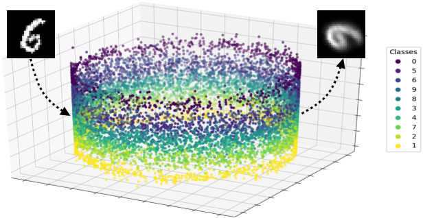

# A Universal Approach to Equivariant Representation Learning


## Setup

```
python 3.6+
pip install -f requirements.txt
```

## Data

Sprites:
`python get_data.py --dataset sprites_data`

Color-shift:
`python get_data.py --dataset colorshift`

Platonics:
`python get_data.py --dataset platonic`

For the multi-sprites, non-discrete classes and rotated MNIST the dataset is generated automatically before training. 

## Experiments

### [5.2] Two-dimensional translations
`python main.py --model-name sprites --extra-dim 3 --action-dim 2 --model cnn --batch-size 64 --dataset sprites`

### [5.3] Multiple two-dimensional translations
`python main.py --model-name multi-sprites --extra-dim 3 --action-dim 6 --model cnn --batch-size 64 --dataset multi-sprites`

### [5.4] Color shift
`python main.py --model-name color-shift --extra-dim 3 --action-dim 6 --model cnn --batch-size 64 --dataset color-shift`

### [5.5] Three-dimensional rotations
`python main.py --model-name platonics --extra-dim 3 --action-dim 4 --model resnet --batch-size 64 --dataset platonics --encoding normalize`

### [5.6] Non-discrete classes
`python main.py --model-name multi-color --extra-dim 1 --action-dim 2 --model cnn --batch-size 64 --dataset multi-color --no-softmax`

### [5.7] Two-dimensional Rotations and Non-Deterministic Action
`python main.py --model-name rotated-mnist --extra-dim 1 --action-dim 2 --model mnist-cnn --batch-size 64 --dataset rotated-mnist --no-softmax`
